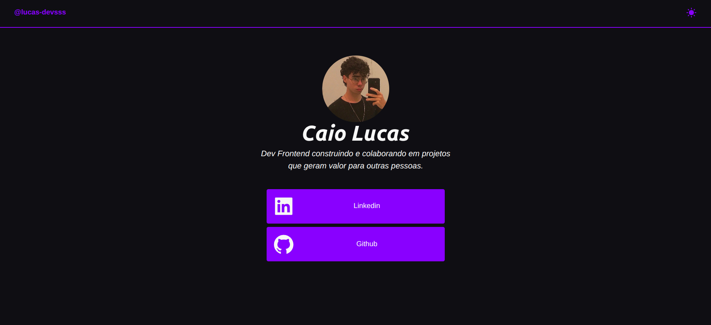
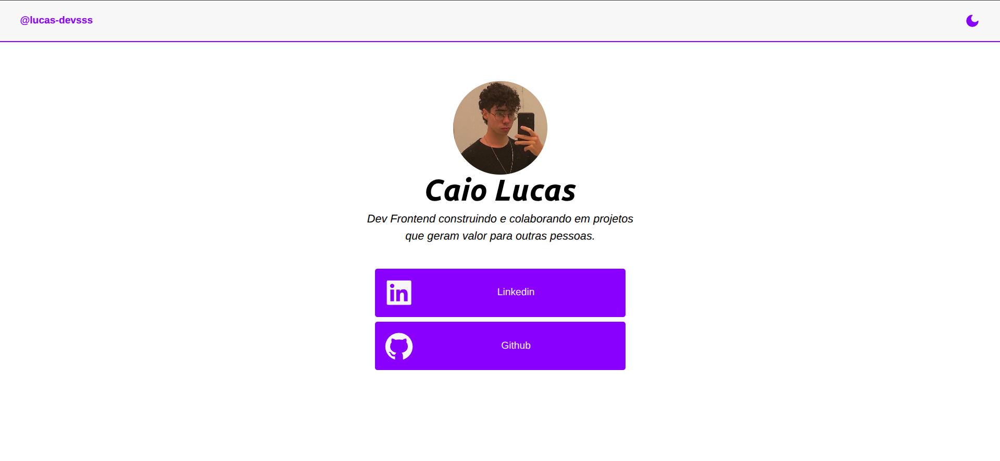

# 📘 DevTree

## 🧩 Sobre o projeto

O DevTree é uma vitrine pessoal one-page, no estilo Linktree, criada para apresentar minha foto, bio e links de redes sociais (GitHub e LinkedIn) em um só lugar.

O projeto conta com dark e light mode com persistência da preferência do usuário via localStorage, identidade visual própria (paleta de cores e tipografia customizadas) e é totalmente responsivo para desktop e mobile.

🔗 **[Acesse o projeto aqui](https://devtrees.vercel.app/)**

---

## 🖥️ Preview

**Desktop**





---

## 🎯 Objetivo do projeto

O projeto tem como foco:

- Aprender e praticar Tailwind CSS
- Entender decisões de design, como paleta de cores, tipografia e hierarquia visual
- Manter uma identidade visual consistente com minha presença em outras redes

---

## 📋 Funcionalidades

- Exibição de foto de perfil, nome e bio
- Links para GitHub e LinkedIn
- Dark mode
- Persistência para o tema

---

## 🚀 Tecnologias utilizadas

- **React** 19
- **TypeScript** 5.9
- **Vite**
- **Tailwind CSS v4**
- **ESLint**
- **React-icons**
- **Git & GitHub**
- **Vercel** (deploy)

---

## ⚙️ Como executar o projeto

### Acessar online

🔗 **[devtrees.vercel.app](https://devtrees.vercel.app/)**

### Rodar localmente

Clone o repositório:

```bash
git clone https://github.com/[seu-nome]/devtree
```

Instale as dependências dentro do projeto:

```bash

npm install

```

Inicie o servidor de desenvolvimento:

```bash

npm run dev

```

---

## 🧠 Aprendizados

- Aplicar classes utility-first
- Entender como o Tailwind lida com responsividade, valores customizáveis e dark mode
- Utilização de bibliotecas de icones
- Criação de interfaces para tipagem de props e icones

## 🧰 Próximos passos

O projeto cumpriu seu objetivo de consolidar Tailwind CSS e fundamentos de design.

### Evoluções futuras planejadas:

- Adicionar link do Instagram e portfólio completo
- Seção de projetos em destaque
- Animações e micro-interações
- Internacionalização (PT-BR / EN)

---

## 👨‍💻 Autor

Feito com 💙 por **Caio Lucas**

🔗 [GitHub](https://github.com/lucas-devsss)
💼 [LinkedIn](https://www.linkedin.com/in/lucas-devsss/)
